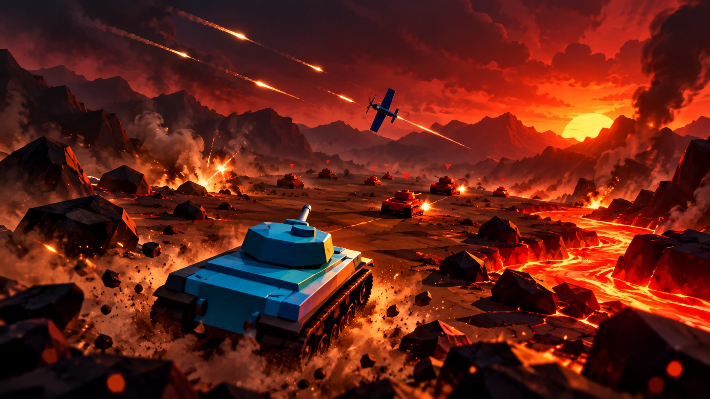

<div align="center">



# 3D 坦克大战

### 每一局都是新战场，而全场**只有你一个人是真人**

硝烟、钢铁与翅膀，全在一个网页里。

**不用下载、不用注册、不用安装任何东西** —— 打开浏览器，点一下「开始战斗」，你就在战场中央了。

<sub>2026 学军黑客松 · 北北 / 钟诚</sub>

</div>

---

## 🚀 怎么跑起来（10 秒上手）

游戏用了 ES 模块，浏览器不允许用 `file://` 直接打开，所以要走一个本地 HTTP 服务。
**零依赖、零构建**：Three.js（r160）已经内置在 `vendor/` 里，没有 `npm install` 这一步。

### 方式一：双击启动（macOS，最省事）

双击项目目录里的 **`启动.command`** —— 它会自动在 `http://127.0.0.1:5173/` 起一个本地服务（只监听本机），并打开浏览器。

### 方式二：任意 Python / Node 静态服务

```bash
# Python 3.8+
python3 -m http.server 5173

# 或者 Node
npx serve -l 5173
```

然后浏览器打开 **http://127.0.0.1:5173/**

> ⚠️ **Safari 用户注意**：macOS 自带的 `python3 -m http.server` 会把 `.flac` 的 MIME 标成 `audio/x-flac`，Safari 对不上就不放音乐。
> 请直接用上面的 **`启动.command`**（里面已经手动把 MIME 补正成 `audio/flac`），或者改用 Chrome / Edge。

**推荐环境**：Chrome / Edge / Safari 最新版，桌面端 + 鼠标键盘。全程不需要联网。

---

## 🎮 操作

| 按键 | 作用 |
| --- | --- |
| `W` / `S` | 坦克：前进 / 倒退　·　飞机：油门加 / 减 |
| `A` / `D` | 坦克：转车体（**可以原地掉头**） |
| `鼠标移动` | 转视角 —— **坦克的炮塔、飞机的机头都自动跟着准星走** |
| `Q` / `E`（或 `←` / `→`） | 键盘转视角 |
| `↑` / `↓` | 调整瞄准高低（抬高 / 压低准星） |
| `空格`（或鼠标左键） | 开炮 / 开火 |
| `F` | 切换 **移动模式** ⇄ **瞄准模式**（点右下角按钮也行） |
| `M` | 静音 / 恢复音效 |

- **移动模式**：跑得快，炮弹散布大 —— 适合抢位置、追击。
- **瞄准模式**：车速降到约三成半、散布极小，还会用虚线把炮弹的飞行轨迹和预计落点画出来 —— 适合隔着几百米点射。

### ✈️ 生存法则（飞机比坦克难得多）

翼尖擦地、擦到障碍物、两机机翼互撞 —— **掉的只是那一片翅膀**；
但**机身直接撞上任何东西，当场就完了**。想稳一点，第一局就先开坦克。

---

## ✨ 一眼看懂它有多上头

**🤖 全场只有你一个真人。** 友军坦克、友军战机、敌军装甲集群 —— 开场就有**三十多个单位**同时在场，每个 AI 都自己找目标、自己机动、自己开火。你只是其中最关键的变量。

**🚗 两种座驾，开局二选一。**

- **坦克**：装甲厚、能应急修理（最多修回一半伤害），扛得住挨打，适合稳扎稳打；
- **飞机**：风驰电掣，能同时打地面和空中目标 —— 但**机身只有一滴血**。

**💥 拟真的部位伤害系统（本作最大亮点）。**

- 打中**机身**，当场坠毁；
- 打中**机翼**，只掉那一片 —— 掉了机翼的飞机会**越滚越偏、越沉越快**，但在坠地之前**还能开炮反杀**；
- 稳稳落地（下沉不急）的不会炸，而是**趴在地上慢慢烧**：烧完之前它就是一个固定炮台，想速杀它得趁现在；
- 两架飞机迎面对上，**撞头 / 撞翼 / 两败俱伤，判定是分开算的**。

**🪖 开局可选纯空战。** 有一定概率地面清空、天上 **2 对 2**，每架飞机 3 条命，被击落了黑屏一秒直接重新升空。

**🗺️ 每一局都是新战场。** 十张地形随机抽，而且**规则真的不一样**，不是换个颜色（见下表）。

**🙈 没有小地图，也看不到别人剩多少血。** 只有你眼前看到的东西 —— **听炮声辨方位，看烟柱找敌军**。敌我识别只靠车体涂装：藏在树后的敌车，涂装被挡住就真的看不出来。这才是战争。

**🎯 误伤友军会被记帐。** HUD 实时统计你的击毁数和友军误伤 —— 别当队内刺客。

**🔊 细节多到数不过来。** 瞄准辅助虚线、弹道下坠、命中装甲的火花、雪地上的履带痕迹、击中反馈、夜战时枪口火光把你自己也照亮……

---

## 🗺️ 十张战场，十套打法

| 地图 | 这张图的特别之处 |
| --- | --- |
| **森林** | 树多、视野差，最适合埋伏 |
| **沙漠** | 900 米超大空旷战场，能看到很远 |
| **草原** | 开阔，沙袋工事多 |
| **丘陵** | 全是小山，起伏大，打的是高处 |
| **雪原** | 会压出**履带印** —— 地上留痕，能靠痕迹反推刚才有谁往哪去了 |
| **火山熔岩** | 黑岩 + 发光的岩浆河，**泡在岩浆里持续掉血**，必须绕路 |
| **城市废墟** | 街区、断墙、集装箱和塌楼，楼房挡视线，巷战距离一下拉近 |
| **花园迷宫** | 大块绿植围成的真迷宫，通道只有 20 米宽，拐角一探头就是一辆车 |
| **山谷** | 24 米高岩壁夹出的窄走廊，**节点以外的通道全盖着岩顶 —— 那是隧道**，飞机从上面打不进来 |
| **海** | 一片真正的海横在战场正中，**深水是硬障碍，坦克开不进去**，只能绕 |

### 🌋 火山会真的喷发

**火山熔岩**那图的正中立着一座爬不上去的火山。打到 **1 分 30 秒**还没分出胜负，火山口当场炸开 —— 之后岩浆贴着地面一圈圈往外漫。能站的干地越来越少，到 **3 分 30 秒**吞掉整个战场，那时候还活着的坦克，就是锅上的蚂蚁。

### 🌊 水是用来"隔离"的

小溪很浅，坦克能趟过去，只是慢；但**海不一样** —— 那是深水，坦克开不进去，只能沿着岸边绕远路。海面上长着荷叶、芦苇和水下的海草。你可以隔着海对轰，但别想开车过去。

### 🌙 夜战

每局有 **10%** 的概率入夜：整体压暗、看不清远处，**全靠枪口火光、曳光弹和爆炸短暂照亮**。夜里开炮那一下会把自己也点亮 —— 挺危险。

---

## 🔊 声音全是现场合成的

没有任何音频素材文件 —— **引擎底噪、主炮、爆炸、命中装甲的敲击、飞机掠过的呼啸、维修的滴答声，全是 Web Audio 现场合成的**，而且**按方位分左右**：左边来的炮弹从左耳响，身后的爆炸从后面闷过来。看不见人的时候，很多时候就靠听声辨位。

另外，**主菜单和结算页各有一段自制 BGM（无损 flac）**。主菜单那首「暮光激战」是**手写一个合成器把谱子"作"出来的** —— 因为既不能用别人的曲子（版权），也不该没有自己的主题曲，所以干脆自己写了一台琴（见 `tools/make-menu-theme.mjs`）。

---

## 🎯 玩法规则速览

- **编队**：玩家 + 随机 **4~9 辆 AI 队友**；敌方总数与友方相同或 ±1。双方都是固定编制，**阵亡不补**。
- **胜负**：把对面的**坦克和飞机全部清空**就算赢。
- **平局**：如果两边在**同一帧**一起被打光（比如最后两辆互射同归于尽），判**平局**，不白送任何一方胜利。
- **侦察兵**：双方各有侦察兵在地图上跑，撞见敌车会回去报点。它们是最低优先级目标，但会一直补人。
- **玩法开关**：右下角有一个隐藏的测试面板（按 `T` 显示 / 隐藏），可以强制指定这一局的玩法，方便你自己试。

---

## 📁 源码在哪

```
坦克大战/
├── index.html            # 入口：页面骨架 + HUD 结构 + importmap
├── cover.jpg             # 封面
├── 启动.command           # macOS 一键启动（起本地服务 + 修正 FLAC 的 MIME）
├── menu-theme.flac       # 主菜单主题曲「暮光激战」
├── result-theme.flac     # 结算音乐
├── src/                  # ← 全部游戏逻辑在这儿（纯 ES 模块，无框架）
│   ├── main.js           #   主循环 / 开局抽签 / 胜负结算 / 相机
│   ├── config.js         #   所有数值和十张地图的配置（想改平衡先看这个）
│   ├── terrain.js        #   程序化地形：高度场、掩体、迷宫、火山、隧道、海
│   ├── tank.js           #   坦克：模型、移动、炮塔、弹夹装填、应急修复
│   ├── ai.js             #   AI 坦克：索敌、瞄准、脱困、避岩浆、撤退
│   ├── plane.js          #   飞机：俯冲、缠斗、分部位损伤、断翼失衡
│   ├── scout.js          #   侦察兵：巡逻、报点、躲避
│   ├── bullet.js         #   子弹：弹道、命中判定、对象池
│   ├── effects.js        #   特效：爆炸、炮口火光、烟、残骸
│   ├── camera.js         #   第三人称相机 + 准星射线
│   ├── hud.js            #   HUD / 菜单 / 结算面板
│   ├── input.js          #   键鼠输入
│   ├── audio.js          #   程序化音效 + 立体声声像
│   ├── aimline.js        #   瞄准模式下的虚线弹道
│   ├── tracks.js         #   雪地履带印
│   └── style.css         #   全部界面样式
├── tools/
│   └── make-menu-theme.mjs  # 手写合成器：渲染主菜单主题曲
└── vendor/
    └── three.module.js   # Three.js r160（已内置，无需联网下载）
```

---

## 🔧 技术实现

- **Three.js r160**，通过 `importmap` 直接以 `import 'three'` 引入本地文件；**全项目零第三方依赖、零构建**。
- **地形全部程序化生成**：噪声高度场（fbm）+ 10 套地图配色；山谷/花园迷宫用"挖通道 DFS"生成骨架；火山是**直接算进高度场**的，所以坦克撞得到、炮弹打得到、AI 也会自己绕开。
- **实例化渲染**：树木、岩石、灌木、沙袋、履带印、岩壁、荷叶芦苇全部走 `InstancedMesh`，几百个物体不掉帧。
- **对象池**：子弹和特效都是复用池（`active` 标记 + 回收），长时间对战不会越跑越卡。
- **全程序化音频**：Web Audio 现场合成，配合 `StereoPannerNode` 做方位感；两首曲子是唯一的声音素材（其中主题曲由仓库里的脚本渲染）。
- **AI 不是"直线冲脸"**：带视野范围与反应延迟、按距离和自身移动状态算瞄准偏差、会贴墙滑行脱困、会躲岩浆、残血会撤退、残局会主动搜剿。
- **开发期用一套 100 项的无头回归测试**守规则（在 Node 里把 DOM mock 掉，直接跑逻辑层 —— 比如"坠机砸中坦克掉 45 血"、"海面把地图横切开"、"隧道岩顶能挡下从正上方打下来的炮弹"），每改一行就跑一遍全量。

---

## 📄 说明

- 端口 **5173**，只监听 `127.0.0.1`，不占用局域网端口。
- 浏览器有自动播放限制：**进场画面点一下「进军」**，音乐才会响（那一下点击也是浏览器要求的那次用户操作）。
- 想改难度或平衡，基本都在 `src/config.js` 一个文件里：编队规模、AI 准头与反应、炮塔俯仰上限、飞机与弹夹参数、十张地图的全部配置，都在那儿。
